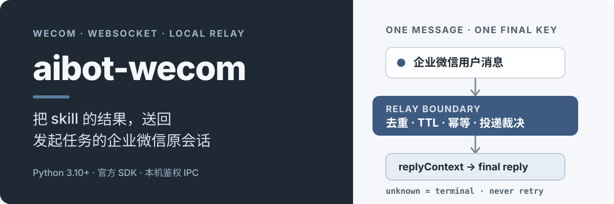

# aibot-wecom



## 这是什么

一个面向企业微信智能机器人的 Python Relay。它通过官方 WebSocket SDK 保留原消息的回复路由，让本地 skill 或编排器只持有短时、不透明的 `replyContext`，再把最终 Markdown 安全地送回发起任务的会话。

> [!IMPORTANT]
> 自动化测试（含 fake SDK 端到端路径）已覆盖 CLI、IPC、幂等与失败分类。**真实机器人人工验收因缺少用户凭据标记为 PENDING**，尚未执行，请勿当作已完成。

## 已验证效果

- **同一事件只签发一个 context**：重复平台事件不会生成新的回复通道。
- **final 回复保持幂等**：已确认送达后，再次请求不会重复调用 SDK。
- **过期 context 会被拒绝**：默认 TTL 为 900 秒（15 分钟），过期后不再允许开始投递。
- **未知结果不会重试**：连接在写入后中断等 `unknown` 状态会进入终态，避免用户收到重复消息。
- **临时失败有明确上限**：仅 `not_delivered` 且明确可重试时，最多尝试三次。
- **IPC 默认拒绝越界数据**：请求需要本机 token，状态响应不包含 Secret、route 或 `replyContext`。

这些行为使用 fake SDK 验证，不需要真实 Bot ID 或 Secret。

## 工作原理

```text
企业微信用户
    │  官方 WebSocket
    ▼
常驻 Relay ── 签发短时 replyContext ──► 本地 handler / skill
    ▲                                         │
    └──── 鉴权本地 IPC ◄──── final Markdown ──┘
    │
    └── 使用 Relay 内保存的私有 route 回复原会话
```

边界划分刻意保持简单：

1. **官方 SDK 适配器**只处理平台帧、连接和回复动作。
2. **RelayService**负责事件去重、context 生命周期、final 幂等和投递结果。
3. **本地 IPC**只暴露受控的 `reply`、`status` 与 `stop` 动作。
4. **skill / handler**只接触用户可见输入、`replyContext` 和最终内容，不读取机器人密钥或原始平台帧。

## 安装与快速验证

需要 Python 3.10+ 和 [uv](https://docs.astral.sh/uv/)。必须在**本仓库根目录**（有 `pyproject.toml` 的目录）执行 `uv sync`，不要在家目录或其他项目的虚拟环境里跑。

```bash
# 推荐用官方安装器，避免依赖当前 python -m pip
curl -LsSf https://astral.sh/uv/install.sh | sh
# 装好后确保 ~/.local/bin 在 PATH 中，必要时重新登录

git clone https://github.com/HuangChenning/aibot-wecom.git
cd aibot-wecom
uv sync
uv run pytest
uv run ruff check .
```

`uv` 已在 PATH 但当前目录没有本仓库时，`uv sync` 会报找不到 `pyproject.toml`，`uv run pytest` / `uv run ruff` 会报找不到可执行文件。先 `cd` 进仓库再执行。不要使用其他项目自带的 `python`（例如已剥离 pip 的 venv）。

`uv sync` 会按 `uv.lock` 安装开发依赖，并把官方 SDK 钉在 `wecom-aibot-python-sdk==1.0.2`（失败分类依赖该版本的异常文案）。自动化测试使用 fake SDK，不会连接企业微信，也不需要配置凭据。

Linux 上长期常驻 `serve` 时，不要依赖登录会话的 `$XDG_RUNTIME_DIR`（注销后 `/run/user/<uid>` 会被清掉）。显式设置 `WECOM_AIBOT_RUNTIME_DIR`（例如 `~/.wecom-aibot/run`），目录权限保持 `0700`。同一 Bot ID 同时只能有一条 WebSocket：上 Linux 前先停掉其他机器上的 `serve`。公司代理环境连企微时可能需要 `NO_PROXY='*'` 或排除 `openws.work.weixin.qq.com`。

## 环境变量

| 变量 | 用途 |
| --- | --- |
| `WECHAT_BOT_ID` | 智能机器人 Bot ID。`serve` 在未指定 `--config` 时读取。 |
| `WECHAT_BOT_SECRET` | 智能机器人 Secret。只允许来自进程环境或仅当前用户可读的配置文件，**不得提交到仓库**。 |
| `WECOM_AIBOT_RUNTIME_DIR` | 覆盖默认运行目录。Unix 默认 `$XDG_RUNTIME_DIR/wecom-aibot` 或 `~/.wecom-aibot/run`；Windows 默认 `%LOCALAPPDATA%\wecom-aibot\run`。 |
| `WECOM_AIBOT_ENDPOINT` | 覆盖默认 IPC 端点路径（默认 `<运行目录>/relay.sock`）。 |

`serve` 也可以用 `--config` 指向仅当前用户可读的 JSON，字段为 `botId` 与 `botSecret`。文件缺失、不是常规文件、或权限对组/其他人开放时，进程会拒绝启动。空白凭据同样会被拒绝。

## 命令

安装后可通过 `wecom-aibot` 或 `uv run wecom-aibot` 调用。

### `serve`

维持官方 WebSocket，并在 owner-only 运行目录内开放本地 IPC。

```bash
export WECHAT_BOT_ID="your-bot-id"
export WECHAT_BOT_SECRET="your-bot-secret"
wecom-aibot serve
```

常用参数：

- `--endpoint`：IPC 端点路径；也可用 `WECOM_AIBOT_ENDPOINT`。
- `--config`：owner-only JSON 凭据文件，替代环境变量。
- `--handler <程序> [参数...]`：每个去重后的文本事件启动一次，stdin 写入单个 JSON（`text`、`replyContext`、`eventId`、`receivedAt`）。handler 的 stdout 与退出码**不构成回复**，必须再调用 `wecom-aibot reply`。
- `--context-ttl`：context 有效期，默认 `900` 秒。

未配置 `--handler` 时，relay 只输出不含正文与 context 的结构化错误。token 写在 owner-only 的 `<endpoint>.token` sidecar；CLI 自行读取，没有 `--token` 参数，也不会打印 token。

### `reply`

把最终 Markdown 送回原会话。正文只经 UTF-8 文件传递，不放进命令行。

```bash
wecom-aibot reply --context "$REPLY_CONTEXT" --content-file ./reply.md
```

可选 `--endpoint` 指向正在运行的 relay。未在 PATH 中安装 CLI 时，用仓库里的解释器调用：

```bash
uv run --project /path/to/aibot-wecom wecom-aibot reply --context "$REPLY_CONTEXT" --content-file ./reply.md
```

### 其他 agent 如何回传

其他 agent 不要自己连企微，也不要持有 Bot Secret。本机先有一条 `wecom-aibot serve`，再把 `skills/wecom-smart-bot-reply/` 交给该 agent 作为常驻 skill 或项目规则。

每次任务还必须由入站消息带上不透明的 `replyContext`（Relay 通过 `--handler` 的 stdin JSON 下发）。agent 跑完业务 skill 后只做：

1. `wecom-aibot status` 退出码为 `0`
2. 把最终 Markdown 写入 UTF-8 文件
3. `wecom-aibot reply --context "$REPLY_CONTEXT" --content-file ./reply.md`

`replyContext` 不得打印或拆开。没有该令牌时不要回传，也不要用 Bot ID/Secret 另开连接。完整契约见 [`skills/wecom-smart-bot-reply/SKILL.md`](skills/wecom-smart-bot-reply/SKILL.md)。

### `status`

查询 relay 是否在运行。成功时 stdout 为脱敏后的 `{"status":"running"}`，退出码 `0`。响应不含 Secret、token、route 或 `replyContext`。

```bash
wecom-aibot status
```

### `stop`

请求 relay 平滑停止：先停止入站，保持 reply IPC 以便排空已启动的 handler，再断开 SDK 并关闭 IPC。

```bash
wecom-aibot stop
```

### `upgrade`

从**固定的** PyPI JSON 接口 `https://pypi.org/pypi/wecom-aibot/json` 读取最新版本，然后执行固定命令：

```bash
uv tool upgrade wecom-aibot
```

默认在交互终端询问确认；自动化场景使用 `--yes`。非交互且没有 `--yes` 时直接拒绝，不会挂起。升级成功后会按 `.dist-info/RECORD` 重新计算安装文件 checksum；校验失败以非零退出码报告失败，**绝不报告成功**，也不会自动回滚。

```bash
wecom-aibot upgrade
wecom-aibot upgrade --yes
```

包尚未发布到 PyPI 时，索引查询会失败并以退出码 `3` 结束。该命令的真实升级路径仍未在已发布包上验证。

## 退出码

对 `reply` / `status` / `stop`：

| 退出码 | 含义 | 调用方动作 |
| --- | --- | --- |
| `0` | `delivered` / `running` / `stopping` | 结束 |
| `1` | 明确未送达、参数错误、凭据或权限不合格、relay 未运行 | 修复后最多再试一次 |
| `75` | `unknown`，无法确定是否已写入 | **不得重试**，转人工核对 |

仅 `upgrade` 额外使用：

| 退出码 | 含义 |
| --- | --- |
| `3` | PyPI 索引不可达或版本不可解析 |
| `4` | 用户拒绝确认 |
| `5` | 非交互环境缺少 `--yes` |
| `6` | 找不到 `uv` |
| `7` | 升级已执行但 RECORD 完整性校验失败 |

## 安全边界

- `WECHAT_BOT_SECRET` 只能来自进程环境或仅当前用户可读的配置文件，不得写入仓库、技能提示或日志。
- Secret、Bearer token、原始平台帧和 `replyContext` 不进入日志或状态响应。
- SDK 所需 route 只保存在 Relay 内部，不通过 IPC 暴露。
- 本地 endpoint 不监听公网；Unix 使用当前用户专用 socket，Windows 绑定 `127.0.0.1` 的 HTTP endpoint。运行目录必须是 owner-only。
- IPC 认证 token 只存在 owner-only sidecar 中；CLI 不接受命令行 token。
- `unknown` 代表“可能已经送达”，因此禁止自动重试。
- 附件上传只有在官方 SDK 能力经过真实验证后才会启用；本地路径不会被伪造成下载链接。

## 项目结构

```text
src/wecom_aibot/                 Relay 运行时
tests/                           fake SDK 与行为测试
skills/wecom-smart-bot-reply/    企业微信原会话回传 skill
```

回传边界与失败策略见 [`skills/wecom-smart-bot-reply/references/relay-contract.md`](skills/wecom-smart-bot-reply/references/relay-contract.md)。

## 当前限制

- **真实机器人人工验收 PENDING**：当前没有用户提供的 Bot ID/Secret，因此未执行建连、私聊入站、最终回复与受控重启后重连。不得把本节写成已完成。
- 自动化测试不使用真实机器人，也不访问真实 PyPI 升级环境。
- 第一版不包含多机器人、聊天历史数据库、Web 管理界面、主动推送、卡片工作流或图片/语音理解。
- Windows IPC、DACL 与信号路径需要在 Windows CI 或实机上验证。
- `wecom-aibot` 尚未发布到 PyPI；`upgrade` 的成功路径与真实 `uv tool upgrade` 交互仍未验证。
